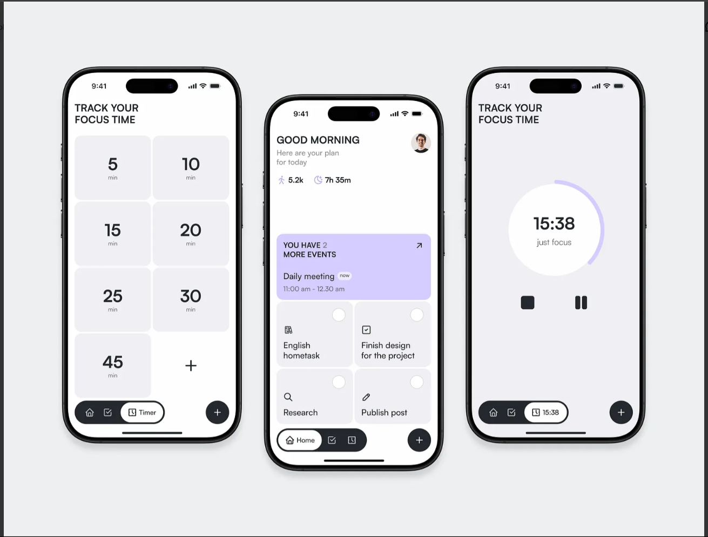

> ⚠️ FocusFlow is currently is ** Deleted from Google Play so this project is not complited and dead **.  
> The app is being improved and polished again. Expect new features soon! 

🧠 FocusFlow

📸 FocusFlow UI Preview 

FocusFlow is an open-source productivity app built with Flutter, designed to help you focus, manage time effectively, and achieve deep work states with minimal distraction.

✨ Features
⏳ Focus Sessions — Start focus timers based on techniques like Pomodoro, Deep Work, or custom flows.

📈 Progress Tracking — See your completed sessions, weekly streaks, and productivity graphs.

🔔 Smart Reminders — Gentle nudges to stay focused without being intrusive.

🎯 Goal Setting — Set daily or weekly goals for focused work.

🎨 Minimal UI — A distraction-free, elegant interface optimized for clarity.

🌙 Dark Mode — Comfortable on the eyes, perfect for late-night focus.

🏗️ Architecture
FocusFlow follows modern Clean Architecture principles:

Data Layer — API/local storage management.

Domain Layer — Pure business logic (entities, repositories, use cases).

Presentation Layer — UI screens and interaction logic (state management).

Key Libraries Used:

## 🛠️ Tech Stack  

  

  

  

  

  

  

🚀 Getting Started
Clone the repository and let's start.

📄 License
This project is licensed under the MIT License — see the LICENSE file for details.

❤️ Contributing
Contributions are welcome and encouraged!
You can:

Open issues for bugs, suggestions, or improvements

Create pull requests with new features or fixes

Help with translations, UI design tweaks, or documentation improvements

🚀 Let's Make FocusFlow the Best Productivity Tool Together!
